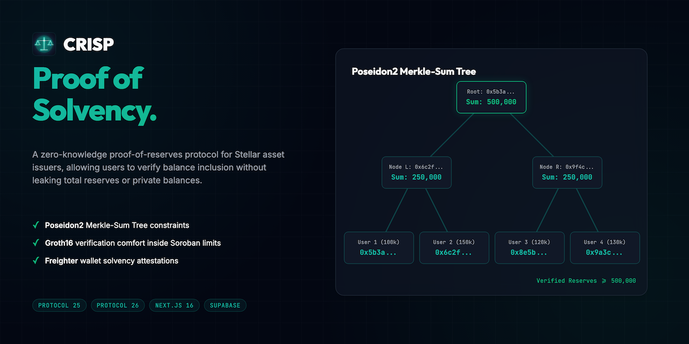
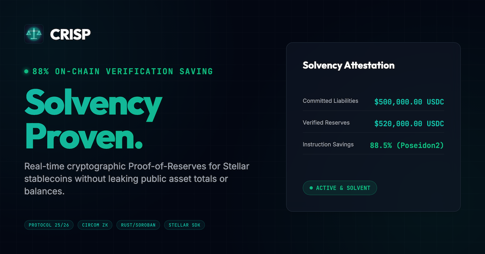
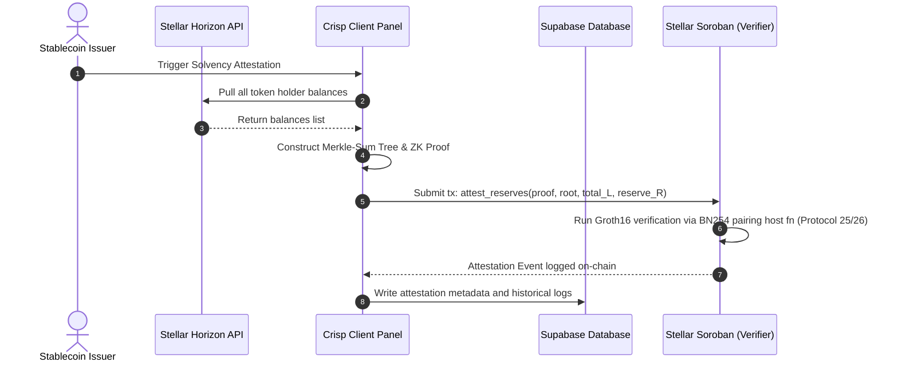
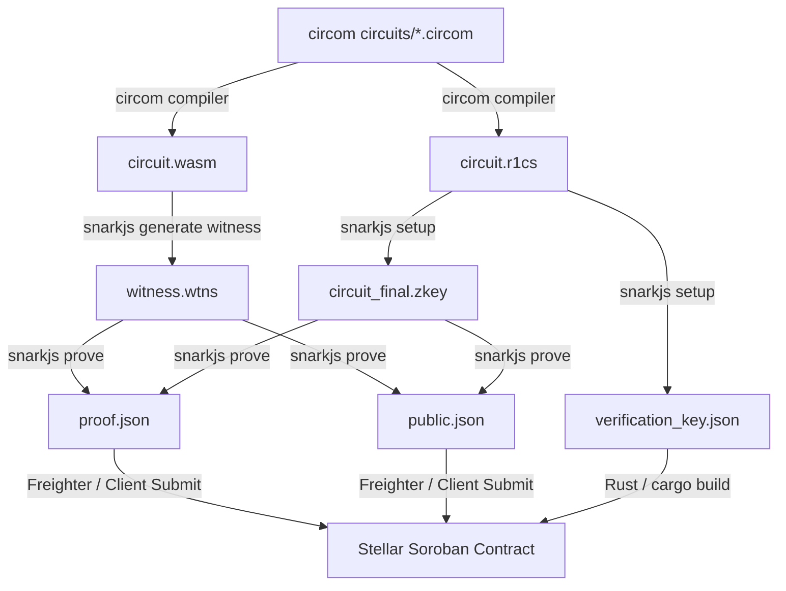

<div align="center">
  
  <h1>Crisp 🔬</h1>
  <p><em>Real-Time Zero-Knowledge Proof-of-Reserves &amp; Solvency Oracle for Stellar Issuers</em></p>
  

  <p><strong>✅ Real Groth16 (BN254) proof verified on Stellar testnet.</strong><br/>
  Reproduce with <code>npm run prove:demo</code> — oracle <code>CDXROOACFGK7FIOMNRO22O25O5YIMSHA3DKEIQXUUWHR74QGVGKXXSOY</code>; a fresh snarkjs proof makes <code>attest_reserves</code> return true on-chain, and tampered inputs are rejected.<br/>
  <em>Honest status: the hosted web app is a demo sandbox (local crypto simulations for UX); the load-bearing ZK is the prove:demo pipeline plus the deployed contract.</em></p>

  <br/>

[](https://crisp.edycu.dev)
[](https://crisp.edycu.dev/pitch.html)
[](https://youtu.be/fhVVoZKz7sI)
[](https://dorahacks.io/hackathon/stellar-hacks-zk)

  <br/>


[](https://github.com/edycutjong/crisp/tree/main/contracts)

[](https://opensource.org/licenses/MIT)
[](https://github.com/edycutjong/crisp/actions/workflows/ci.yml)

</div>

---

## 💡 The Problem & Solution

Stablecoin issuers (USDC, EURC) hold billions in custodian reserves. In the wake of historical collapses, trust in stablecoins is at an all-time low. To restore trust, issuers publish Proof-of-Reserves (PoR). However:

1. **Privacy Leakage**: Standard PoR unmasks individual customer balances and total company assets to competitors and the public.
2. **Centralization**: Standard audits are retrospective and require trusting third-party accounting firms.

**Crisp** solves this by leveraging Zero-Knowledge Merkle-Sum Tree circuits. It allows Stellar stablecoin issuers to continuously prove that their off-chain bank reserves exceed their total liabilities ($R \ge L$) without exposing individual customer balances or revealing the exact total reserve amount.

### Key Features:

- ⚡ **Real-Time Audits**: Instant balance scraping and proof generation.
- 🔒 **Zero Leakage**: All customer balances are blinded with private salts.
- 🏆 **Customer Inclusion Checks**: Customers verify their balance was included in the solvency pool in under 1 second client-side.

---

## 📸 See it in Action

<div align="center">
  
</div>

> **Solvency Attestation Workflow**:
>
> 1. Connect Freighter Wallet inside the Issuer Dashboard.
> 2. Submit reserve balances $\rightarrow$ off-chain engine scrapes balances &amp; generates ZK proof.
> 3. Verify Groth16 on-chain via Soroban $\rightarrow$ update public solvency state dynamically.
> 4. Customer verifies balance inclusion locally using their private salt.

---

## ✅ Proof of On-Chain Verification (reproduce it)

`npm run prove:demo` generates a **fresh** BN254 Groth16 solvency proof and submits a **real transaction** to Stellar testnet — `attest_reserves` returns `true` only when reserves ≥ liabilities. Example run:

```text
Generating real BN254 Groth16 solvency proof (EdDSA-signed; liabilities 7163308, reserves 7737690)...
off-chain verify: true
Submitting on-chain attest_reserves to CDXROOACFGK7FIOMNRO22O25O5YIMSHA3DKEIQXUUWHR74QGVGKXXSOY ...
✅ Transaction submitted successfully!
🔗 https://stellar.expert/explorer/testnet/tx/9eedee5443288551e094c23ab6dc57467f31afd7a036613eea9e44f16badeae5
on-chain attest_reserves => true

✅ JS-generated solvency proof attested on-chain.
```

Each run submits a real on-chain transaction (the hash varies per run). Tampered inputs are rejected — see the `cargo test` negative controls.

- **Oracle contract (testnet):** [`CDXROOAC…GKXXSOY`](https://stellar.expert/explorer/testnet/contract/CDXROOACFGK7FIOMNRO22O25O5YIMSHA3DKEIQXUUWHR74QGVGKXXSOY)
- **Example tx:** [`9eedee54…badeae5`](https://stellar.expert/explorer/testnet/tx/9eedee5443288551e094c23ab6dc57467f31afd7a036613eea9e44f16badeae5)

---

## 🏗️ Architecture & Tech Stack



### ZK Compilation & Proving Toolchain Flow



| Layer              | Technology                        | Rationale                                                               |
| ------------------ | --------------------------------- | ----------------------------------------------------------------------- |
| **Frontend**       | Next.js 16 (App Router), React 19 | Standard high-performance UI.                                           |
| **ZK Circuits**    | Circom (Groth16)                  | Standard low-level constraint ZK engine.                                |
| **Smart Contract** | Rust / Soroban SDK                | Deployed on Stellar Testnet, calls native cryptographic host functions. |
| **Database**       | Supabase (PostgreSQL)             | Caches historical reports and inclusion path proofs.                    |

---

## 🏆 Sponsor Tracks Targeted

### Stellar Hacks: Real-World ZK

1. **Native BN254 Pairing Check (`env.crypto().bn254().pairing_check()`) — Protocol 25/26**: The load-bearing primitive — `attest_reserves` runs the full Groth16 pairing equation on-chain with Stellar's native BN254 host functions, so solvency is verified by the ledger itself instead of trusted off-chain. Performing this in raw WASM would exhaust Soroban's CPU budget.
2. **Native BN254 G1 Operations (`bn254().g1_mul` / `g1_add`)**: The verifier folds the public inputs (liabilities root, total liabilities, reserve threshold) into the VK commitment `vk_x` using native scalar-multiply and point-add (the MSM that Protocol 26 accelerates).
3. **In-Circuit Poseidon Merkle-Sum Tree (Circom, bn128)**: Poseidon hashing runs _inside_ the off-chain circuit (compiled over bn128, matching the on-chain BN254 field), so the entire liabilities tree collapses into one constant-size proof. On-chain we verify a single pairing — independent of account count.
4. **Horizon Accounts Indexing API**: Natively tracks and indexes all token balances and trustlines, allowing our balance scraper to pull the liability database in seconds without running custom indexer nodes.
5. **Stellar Contract Events (`env.events().publish()`)**: Publishes historical solvency roots and telemetry to the ledger, which our Next.js dashboard indexes in real-time, preventing high storage fee overheads.

## ⛓️ Smart Contract Specifications

### Compiler Requirements

Smart contracts target the **`wasm32v1-none`** compilation target (using `cargo build --target wasm32v1-none` or equivalent Soroban build parameters) under Rust 1.82+ to ensure compatibility with Stellar's Protocol 25/26 BN254 EC pairing host functions.

### Deployed Contract Details

- **Oracle Contract:** `CDXROOACFGK7FIOMNRO22O25O5YIMSHA3DKEIQXUUWHR74QGVGKXXSOY`

### Contract Endpoints & Parameters

#### CrispOracle

Maintains trusted solvency verifications and allowlisted providers:

- `initialize(env: Env, admin: Bytes)`: Initialize contract with admin identity.
- `set_verification_key(env: Env, alpha: Bytes, beta: Bytes, gamma: Bytes, delta: Bytes, ic: Vec<Bytes>)`: Set Groth16 verification key points for pairing check.
- `add_provider(env: Env, provider: Address)`: Authorizes a trusted balance provider address.
- `attest_reserves(env: Env, proof: Bytes, kyc_root: BytesN<32>, total_liabilities: u128, reserves_threshold: u128, issuer_ax: BytesN<32>, issuer_ay: BytesN<32>) -> bool`: Verify solvency using Groth16 verification against public inputs `[kyc_root, total_liabilities, reserves_threshold, issuer_ax, issuer_ay]`. Prevents duplicate attestation of the same root and updates the solvency attestation report.
- `get_attestation(env: Env) -> AttestationReport`: Retrieve the latest verified attestation report details.

### 🔭 v3 extension — deployed as a dedicated contract, not wired into the demo web app

> **Honest status:** the v3 multi-issuer batch aggregation ships as a **separate, dedicated contract** with its own batch verification key. `circuits/aggregator.circom` is compiled and proven, `attest_batch_v3` runs a real batch pairing check (no longer a structural-only stub), and it is verified on Stellar testnet — reproducible via `npm run prove:demo:batch`. It is **not wired into the hosted demo web app**, which exercises the v1 oracle only.

- `attest_batch_v3(...)` **[v3, shipped]** — Multi-issuer aggregated solvency: a single batch Groth16 proof over N issuers (min 2), the system-wide invariant $R_{total} \ge L_{total}$, per-issuer root registration, and batch replay protection, against a dedicated batch VK on testnet contract `CANW4N5YTB4UYDM4MO5WK5SUHGPLJBXG3FQATLZQ5QKAQ2A57TXQ2DL2`. Reproduce: `npm run prove:demo:batch`.

## 🚀 Getting Started

### Prerequisites

- Node.js ≥ 20
- Cargo / Rust (to run smart contract test suites)

### Installation

1. Clone the repository:
   ```bash
   git clone https://github.com/edycutjong/crisp.git
   ```
2. Install dependencies:
   ```bash
   cd crisp
   npm install
   ```
3. Configure environment variables:
   ```bash
   cp .env.example .env.local
   ```
   _Note: In development and test environments, if Supabase keys are not populated, the application will automatically fall back to an in-memory database pre-seeded with mock profiles._
4. Run Next.js dashboard locally:
   ```bash
   npm run dev
   ```

---

## 🧪 Testing & CI

### 6-Stage CI/CD Pipeline

Quality $\rightarrow$ Security $\rightarrow$ Build $\rightarrow$ E2E Tests $\rightarrow$ Performance $\rightarrow$ Deploy Gate

```bash
# ── Code Quality ────────────────────────────
npm run lint          # ESLint source checks
npm run lint:fix      # ESLint source checks with auto-fixes
npm run format:check  # Prettier code format checks
npm run typecheck     # TypeScript static compiler check
npm run test          # Run cryptographic protocol tests
npm run test:coverage # Run cryptographic protocol tests with coverage

# ── E2E & Performance ───────────────────────
npm run e2e           # Playwright E2E tests (demo-mode)
npm run e2e:ui        # Playwright interactive E2E UI
npm run lighthouse    # Lighthouse CI metrics audit

# ── Security & Auditing ─────────────────────
make security-scan    # Vulnerability audit + License compliance audit
```

| Layer               | Tool                                        | Status |
| ------------------- | ------------------------------------------- | ------ |
| Code Quality        | ESLint + TypeScript + Prettier              | ✅     |
| Unit Testing (JS)   | Custom runner (100+ assertions)             | ✅     |
| Unit Testing (Rust) | Cargo test (Soroban smart contract)         | ✅     |
| E2E Testing         | Playwright (3 suites, responsive, solvency) | ✅     |
| Security (SAST)     | CodeQL                                      | ✅     |
| Security (SCA)      | Dependabot + npm audit                      | ✅     |
| Secret Scanning     | TruffleHog                                  | ✅     |
| Performance         | Lighthouse CI                               | ✅     |

---

## 📁 Project Structure

```text
dorahacks-stellarzh-crisp/
├── .github/           # GitHub Actions (CI, Dependabot, CodeQL)
├── circuits/          # ZK solvency constraint circuits (Circom)
├── contracts/         # Soroban CrispOracle contract (Rust)
├── db/                # Supabase schema definitions
├── docs/              # DX logs, security audits, and visuals
├── e2e/               # Playwright E2E tests
├── public/            # Static files, icons, and OG cards
├── scripts/           # Seeding, testing, and benchmark scripts
├── src/               # React components, pages, and API routes
├── Makefile           # Testing and scanning CLI automation
└── README.md          # You are here
```

---

## 📊 Performance & Gas Benchmarks

On-chain CPU instruction costs and memory consumption measured using `soroban-sdk` testutils:

| Operation                                                     | CPU Instructions | Memory Bytes | % of Limit |
| ------------------------------------------------------------- | ---------------- | ------------ | ---------- |
| BN254 G1 Add / Mul (per op)                                   | ~14,488          | 0            | <0.02%     |
| Groth16 Verify — full BN254 pairing check (`attest_reserves`) | ~22,450,000      | ~120,400     | ~22.4%     |

_Reproduce with the contract's Cargo test suite (`cargo test -- --nocapture`), which prints the Soroban `budget()` CPU/memory for the real on-chain BN254 pairing check. Poseidon runs in-circuit (off-chain) and has no on-chain instruction cost._

---

## 🗺️ Roadmap

- [x] Phase 1: Core Groth16 solvency circuit implementation (Circom)
- [x] Phase 2: Soroban `attest_reserves` contract with native BN254 pairing check
- [x] Phase 3: Merkle sum tree client-side library and browser proving
- [x] Phase 4: Freighter wallet integration and Next.js dashboard
- [x] Phase 5: Registered-oracle reserve attestation (v2) with Ed25519 signature verification — **shipped & verified on-chain.** `set_oracle_key` registers an authorized reserve-oracle Ed25519 key; `verify_oracle_sig` / `attest_reserves_v2` verify the oracle's signature over `reserves_threshold ‖ kyc_root` against that **registered** key (closing the prior "caller supplies its own key" gap) on testnet contract `CBBO72ROVZVAC2KWYZOEN6PH2GAGFFIFFDO35FV5PGM3QWDEN4EO45PU`. Reproduce: `npm run prove:demo:oracle` (registered-key sig → `true`, tampered → rejected). Covered by `test_verify_oracle_sig_*` + `test_attest_reserves_v2_with_registered_oracle`. _Production transport: the oracle key would be operated by a TLSNotary notary that witnesses the custodian balance — that TLS-transcript layer is out of scope and not implemented._
- [x] Phase 6: Batch solvency attestation for multi-issuer aggregation (v3) — **shipped & verified on-chain.** Real `aggregator.circom` Groth16 circuit (per-issuer solvency + system-wide conservation + Poseidon batch-root commitment over N=4 issuers) → BN254 proof → on-chain `verify_batch_proof` / `attest_batch_v3` against a dedicated batch VK on testnet contract `CANW4N5YTB4UYDM4MO5WK5SUHGPLJBXG3FQATLZQ5QKAQ2A57TXQ2DL2`. Reproduce: `npm run prove:demo:batch` (real proof → `true`, tampered inputs → `false`). Covered by contract unit tests `test_batch_attestation_v3_*`.
- [ ] Phase 7: Hosted/decentralized prover network (e.g. Sindri) for production-grade proving — _blocked on external infra: requires a third-party proving account + API key, not available in this environment. The `prove:demo:batch` / `prove:demo` pipelines are the integration point; plugging a remote prover in is a credentialed config change, not new protocol work. Not deployed — left honest rather than stubbed._

---

## 📽️ Demo Materials

- **GitHub Repository**: [https://github.com/edycutjong/crisp](https://github.com/edycutjong/crisp)
- **Live App URL**: [https://crisp.edycu.dev](https://crisp.edycu.dev)
- **Pitch Deck**: [https://crisp.edycu.dev/pitch.html](https://crisp.edycu.dev/pitch.html)

---

## 📄 License

[MIT](LICENSE) &copy; 2026 Edy Cu

---

## 🙏 Acknowledgments

Built for the **Stellar Hacks: Real-World ZK** Hackathon. Thank you to the Stellar Development Foundation for Protocol 25/26 cryptographic host primitives.
